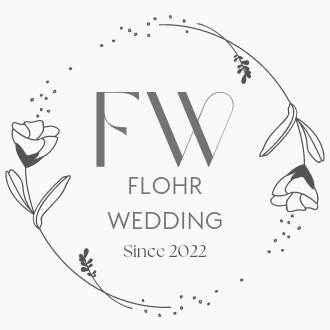

# FlohrWedding - Mi primer proyecto de ReactJs

Es un e-commerce realizado con el curso de ReactJs en Coderhouse.


## Lenguajes de progamacion utilizados

- HTML
- CSS
- Javascript

## Base de datos

- Firebase

## Instalación

### 1. Clonar el repositorio

```
$ git clone https://github.com/FlorenciaNicole/ReactJS_Manzanos
```

### 2.Install NPM packages

```
npm install
```

### 3. Run he APP

```
npm start
```
